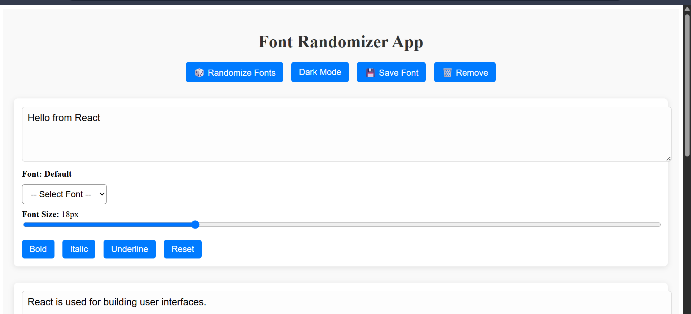
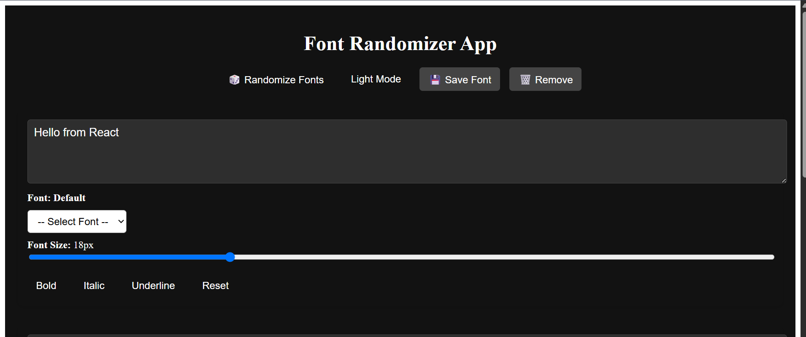

# 🎨 Font Style Randomizer (React App)

A fun and creative React application that allows users to experiment with Google Fonts by applying different font styles to sample text blocks like headings, paragraphs, and quotes.

---

## 🚀 Features

- 🎲 **Randomize Fonts**: Apply random Google Fonts to text blocks.
- 📝 **Custom Text Input**: Edit sample text directly.
- 🎨 **Style Controls**: Apply **Bold**, _Italic_, or Underline styles to each block.
- 🔠 **Font Size Slider**: Adjust font size dynamically.
- 🌙 **Dark Mode Toggle**: Switch between light and dark themes.
- 🔄 **Reset Button**: Revert text block styles to default.
- 💾 **Save Configuration**: Save font and style settings in localStorage.
- 🗑️ **Remove Configuration**: Clear saved font styles.
- 👁️‍🗨️ **Live Font Preview in Dropdown** (Enhanced Feature)

---

## 🛠️ Setup Instructions

### 1. Clone the Repository

```bash
git clone https://github.com/your-username/font-randomizer.git
cd font-randomizer
```

### 2. Install Dependencies

```bash
npm install
```

### 3. Start the Development Server

```bash
npm run dev
```

The app will run at `http://localhost:5173` (if using Vite).

---

## 🖼️ Screenshots

### Light Mode  


### Dark Mode  


>

---

## 📁 Tech Stack

- React.js
- Vite
- Google Fonts API
- CSS Modules


